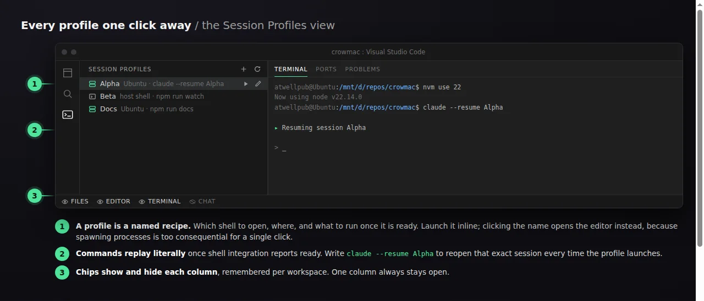
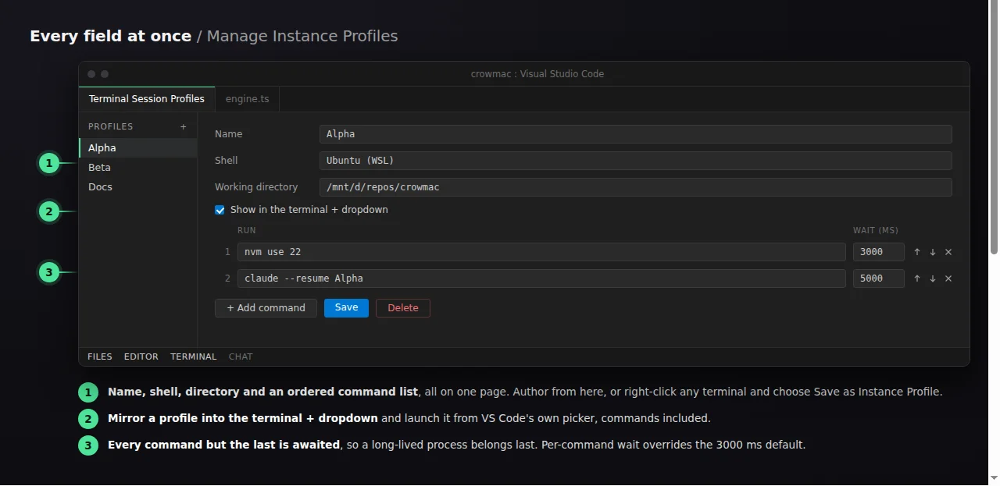
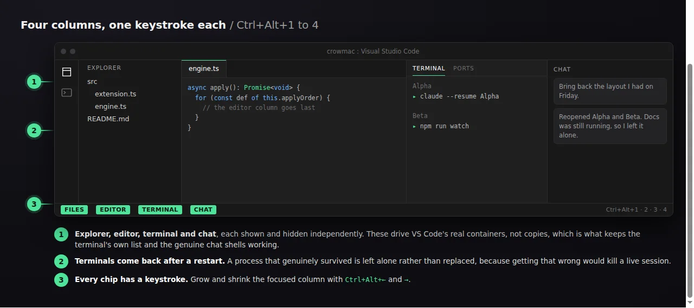

Save a terminal as a reusable **session profile** (which shell to open, where, and what to run once it is ready), then bring it back with one click after a restart. It also repositions the Explorer, editor, terminal and chat panes as collapsible columns driven from the status bar.

## Session profiles

A profile is a named recipe. Create one from the sidebar's **＋**, or right-click any terminal and choose **Save as Instance Profile** to start from a terminal you already have open.

- **Sidebar.** Every profile, with an inline ▶ to launch and ✎ to edit. Clicking a profile edits it rather than launching, because spawning processes is too consequential for a single click.
- **Editor.** All fields at once: name, shell, directory, and an ordered command list you can reorder and delete inline.
- **Terminal `+` dropdown.** Tick *Show in the terminal `+` dropdown* and the profile is mirrored into `terminal.integrated.profiles`, appearing there by name. Commands still run, because the extension replays them whenever a terminal opens with a matching name.

Commands run in order once shell integration reports ready. **Every command but the last is awaited**, so a long-lived process such as `claude` belongs last. They are stored and replayed **literally**: write `claude --continue` to rejoin the most recent conversation in that directory, or `claude --resume <id>` to pin an exact one.

## Restoring after a restart

Out of the box, closing a VS Code **window** loses your terminals entirely. `terminal.integrated.persistentSessionReviveProcess` defaults to `onExit`, which means *application* exit, so a window close or a stopped debug session takes them with it. Terminal Session Profiles widens that to `onExitAndWindowClose`, and that alone is what makes the tabs come back.

Tabs are only half of it. A revived tab is a fresh **default-profile** shell with your old scrollback replayed into it: the name is right and the text looks familiar, but the shell is wrong and nothing is running. In testing, an `Alpha` tab that had been Ubuntu with `claude` in it came back as a bare `PS D:\...>` prompt.

So the extension does the other half too. Launched profiles are remembered per workspace, and on startup each revived tab whose name matches a saved profile is disposed and relaunched as that profile, in the right shell, with its commands replayed. Automatic by default, or on demand from the **Restore** chip in the status bar.

A terminal whose process genuinely survived is left alone rather than replaced: the process id recorded at launch is compared against the one that came back, because the two cases are indistinguishable by name and getting it wrong would kill a live session.

## Columns

The Explorer, editor, terminal and chat panes can be shown and hidden from status-bar chips, with visibility remembered per workspace. These drive VS Code's **real containers** (the primary sidebar, the editor area, the panel and the secondary sidebar) rather than recreating them, which is what keeps the terminal's right-hand terminal list and the genuine Claude and Codex chat shells.

**One column always stays open.** The last visible chip refuses to hide, rather than leaving you with an empty window and nothing lit to get back from.

### The editor column is not like the other three

The others are independent of one another. The editor is not, because of how VS Code hides it: `workbench.action.toggleEditorVisibility` is a one-line delegation to `toggleMaximizedPanel()`. The editor area does not hide into nothing: **its space is handed to the panel**. Two consequences are worth knowing before you bind a key to it:

- The editor and terminal columns can never be hidden at the same time, and each moves the other. Hiding the editor reveals the terminal column if it was closed, because something has to receive the space. Hiding the terminal while the editor is hidden brings the editor back, since VS Code un-maximizes the panel on its way out.
- Hiding the editor from VS Code's own **View → Appearance** menu instead of the chip leaves the chip showing the wrong state. Nothing can be done about that: the real state lives in a context key (`mainEditorAreaVisible`) that extensions can set but never read, which is the same reason the other three chips cannot see their containers being closed by their own title-bar buttons.

On a host too old to have either command the chip is dropped entirely rather than shown doing nothing. **Reset Layout** brings everything back.

## Commands

| Command | Default key |
|---|---|
| Manage Instance Profiles | none |
| New Instance Profile / Open Profile / Edit Profile | none |
| Save as Instance Profile | terminal right-click |
| Restore Last Session | status-bar chip |
| Toggle Files / Editor / Terminal / Chat | `Ctrl+Alt+1` / `2` / `3` / `4` |
| New Terminal in Column | ``Ctrl+Shift+` `` |
| Grow / Shrink Focused Column | `Ctrl+Alt+←` / `→` |
| Reset Layout | none |

## Settings

| Setting | Default | |
|---|---|---|
| `terminalSessions.instanceProfiles` | `[]` | Saved recipes. Hand-editable. |
| `terminalSessions.autoRestoreSession` | `true` | Reopen saved profiles on startup. |
| `terminalSessions.restoreDelayMs` | `3000` | Wait for VS Code's own revival first, so tabs are not duplicated. |
| `terminalSessions.layout.autoEnableEverywhere` | `true` | Bring the column layout up in every workspace. |
| `terminalSessions.layout.autoEnable` | `true` | Bring it back on startup where it was already on. |
| `terminalSessions.columns` | built-in | Which containers the chips control. |

### The two halves are independent

Session profiles and the column layout share an extension, not a switch. **Enable / Disable Column Layout** governs the columns and nothing else: profiles, replay and session restore keep working with the layout off. Disabling the layout sticks, and it outranks `layout.autoEnableEverywhere`, so a workspace you turned it off in stays off across reloads.

While the layout is enabled, four settings are managed at global scope and restored on disable: `terminal.integrated.defaultLocation`, `workbench.panel.defaultLocation`, `terminal.integrated.persistentSessionReviveProcess` and `workbench.panel.opensMaximized`.

## Why profiles are declared rather than captured

The obvious design is to right-click a terminal and save what it is doing. That is not possible, for two independent reasons:

- `Terminal.creationOptions` comes back **empty** for terminals VS Code launched from a profile, so the shell cannot be read back.
- Shell integration is **blind to nested shells**. With `claude` running inside `wsl` inside PowerShell, no shell-execution event ever fires for it.

At the moment of the right-click there is genuinely nothing to read, so a profile is declared once and replayed thereafter.

## Install

Search for **Terminal Session Profiles** in the VS Code Extensions view, or install `GBTI.gbti-terminal-sessions` from the Visual Studio Marketplace. Also published to Open VSX for VSCodium. MIT licensed, and the source is on GitHub.
