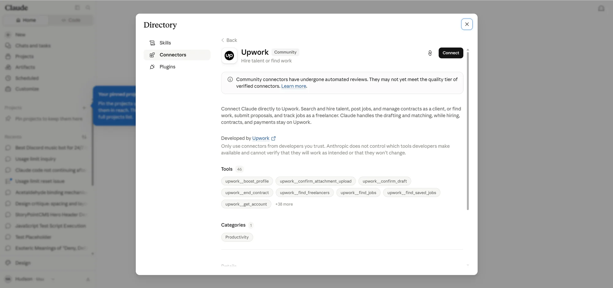

On August 10, 2026, Upwork announced a server for the Model Context Protocol. An agent can now post a job, shortlist freelancers, prepare an offer and summarize proposals as they arrive, without anyone opening a browser tab.[^1]

Before getting to why Upwork built one, the protocol itself needs explaining. An MCP server resembles a REST API, and Upwork's sits on the same APIs its website and public API already use.[^2] The difference is who does the calling. A REST endpoint waits for code a developer wrote against its documentation. An MCP server publishes a typed list of what it can do, things like searching jobs, sending a message or creating a milestone, and the assistant, the agent app you added the server to, puts that list in front of the model, then makes whichever calls the model picks. No page is fetched, nothing is rendered, no human clicks anything, and the result lands in the conversation you are already having. Think of an MCP server as an extension to the assistant rather than to the model: the model arrives able to converse, and the server gives the assistant a set of things it can now do on your behalf.

[Peter Sanborn](https://www.linkedin.com/in/petersanborn1/), Upwork's chief business officer, described what prompted it:

> We started seeing something remarkable this year: AI agents attempting to log into Upwork on their users' behalf to search for the right person to hire.[^1]

A marketplace watched software try to get in through the front door and decided to install a door.

## Any MCP-compatible assistant can reach the Upwork server

The announcement names Claude, ChatGPT and Cursor, then adds "any MCP-compatible product."[^1] The documentation goes further, listing Claude on web, desktop and Code, Cursor and Codex in app and CLI form, and naming Windsurf, Cline, VS Code and Goose as examples of anything else that speaks remote MCP with OAuth.[^2]

Upwork's documentation gives `claude.ai/directory/connectors/upwork` as the recommended install path, with a ChatGPT listing still to come.[^2] That address is not a public page. It opens Claude's own connector directory inside the app, where the entry credits Upwork as the developer and exposes 46 tools under names like `upwork__find_freelancers`, `upwork__confirm_draft` and `upwork__end_contract`.[^3]

Anthropic files it under **Community** rather than verified, noting that community connectors "have undergone automated reviews" and "may not yet meet the quality tier of verified connectors". The notice beside it reads "Only use connectors from developers you trust. Anthropic does not control which tools developers make available and cannot verify that they will work as intended or that they won't change."[^3]

## Every Upwork account gets it free, but your assistant plan may block it

Upwork's MCP server is open to every Upwork user at no additional cost: "available today for every Upwork client and freelancer, at no additional cost."[^1] The documentation says the same, that it is "free to use with any Upwork account."[^2]

ChatGPT offers custom MCP connectors on Plus, Pro, Team, Business and Enterprise, which leaves a free ChatGPT account unable to add the Upwork server at all; a Claude free account can add it, but only as its one permitted connector; and ChatGPT's Instant mode cannot make MCP tool calls whatever the plan.[^2]

On the marketplace side, universal availability decides who benefits. A capability that ships to everyone at once and costs nothing confers no advantage by being adopted, only on people who restructure how they work around it.

## What the agent can do: mostly administration, plus one delivery step

The announcement lists the prompts it expects:[^1]

- "My prototype is almost ready to launch. Help me find a freelancer on Upwork who can test it end-to-end before it goes live."
- "I'm launching a new ecommerce product and need help with paid acquisition. Post a job to Upwork and summarize proposals as they arrive."
- "Show me this week's jobs that match my skills and fit my budget and availability."
- "Summarize my Upwork client messages and flag which ones need a follow-up today."

Three of the four are administration. Finding, posting, summarizing, triaging. The agent handles the paperwork around the work rather than the work.

The documentation covers a third role the announcement skips. Alongside clients and freelancers, agencies get a team-wide view: one call returning every member's invitations, offers, messages and contracts.[^2]

One capability does touch delivery. A freelancer can submit milestone work through the connector.[^2] With job posting, proposal review and client messaging already inside the agent, the only steps reserved for a person are the binding ones, and a pipeline running from brief to delivered work without anyone opening a browser starts to look like a question of policy rather than plumbing.

## How a client is meant to de-risk the expert they pick

Upwork's answer is identity and money. Every connection runs through an authenticated account, and the company leans on its existing identity verification, escrow and dispute protections.[^1] Those cover fraud and non-delivery, and they say nothing about whether the three names in front of you are the right three. We read the documentation looking for the ranking inputs and they are not disclosed: a client can "Pull up ranked profiles" and "review proposals received, with ranked summaries", and the page never names Job Success Score, Top Rated, or any other quality signal Upwork already publishes.[^2] The word doing the work is "ranked", and nothing says ranked by what.

The controls on the agent itself are documented far better than the ones on the shortlist. Every write action is drafted for separate confirmation, binding financial actions complete on upwork.com rather than inside the agent, and connecting nonetheless "grants the full set of scopes", so there is no way to attach an agent to job search while withholding messaging, contracts or financial history.[^2] Rohit Singh, founder of Populosof and one of two customers quoted in the announcement, put the upside plainly: "every action that changes anything is previewed and requires my explicit confirmation."[^1] So a client de-risks the transaction and picks the expert on trust.

## Are AI Agents Themselves Able to Shop On Upwork?

Upwork's FAQ asks whether an AI agent can hire on your behalf without you, which is the client side of the question, and answers: "Not today. In the current release, a person confirms every binding action."[^2]

Read the hedge. "Not today" and "in the current release" are the words of a company that has thought about the other version and has not shipped it.

## How does the affiliate program work with MCP?

Upwork's affiliate program pays 70% of a new client's first contract spend, capped at $150, tracked through the Impact platform with a cookie window measured in weeks.[^4] Every part of that mechanism assumes a browser. A link is clicked, a cookie is set, a signup is attributed.

An MCP conversation runs directly between the agent and the server, so the browser, the click and the cookie that mechanism depends on never come into existence. A founder who asks Claude to post a job and hires someone that afternoon leaves no referral trail, so whoever recommended Upwork in the first place is invisible to the attribution system.

Will Anthropic and OpenAI demand a share of the profit? There are arguments for it, most certainly.

## What an agent-driven marketplace means for a vetted network like Codeable

**Disclosure:** the [Codeable](https://gbti.network/outbound/codeable) link here is a referral link. GBTI Network is a big fan of the Codeable community for React and WordPress work.

Codeable is the opposite bet. It is a closed talent network that accepts roughly 2.2% of applicants, where a client brief goes to a small group of pre-vetted experts who discuss it in a shared workroom and independently estimate, and the platform returns one averaged fixed price against a 17.5% fee.[^5]

The reflex is to say an agent-driven marketplace threatens that model. The opposite seems more likely.

A network like Codeable has several reasons to publish one, and they are mostly the reasons Upwork did. A connector puts a vetted talent pool inside the tools its best clients already work in. It makes that same pool reachable by the network's own contractors, who could assemble a team on demand instead of routing it through a coordinator. A devops lead could pipe work straight to the embedded developer they already trust, without rebuilding the relationship each time there is something to do. And every party keeps agentic help for the transactional layer, the scoping and scheduling and status chasing, which is the part none of them wanted to be doing by hand.

## Where the AI first pass runs out

Sanborn described what Upwork sees on the demand side. Clients "are showing up with an AI-generated first pass that got them part of the way there but still need a real person to take it the rest of the way."[^1]

[^1]: Upwork Inc., "Upwork Talent Is Now Everywhere AI Works," press release via GlobeNewswire, August 10, 2026, read August 12, 2026. Source of the launch date, the Sanborn and Singh quotes, the four example prompts, the identity, escrow and dispute language, and the "available today for every Upwork client and freelancer, at no additional cost" wording. The release carries two customer quotes; the second is from Allison Lee, an independent AI operations specialist on Upwork. Sanborn's name links to his LinkedIn profile, which the author opened and confirmed on August 13, 2026; LinkedIn serves an authwall to signed-out clients, so it is not readable from the article itself: [globenewswire.com](https://www.globenewswire.com/news-release/2026/08/10/3342153/0/en/upwork-talent-is-now-everywhere-ai-works.html)

[^2]: Upwork, "Upwork MCP Server," product documentation, page dated August 4, 2026, read in a browser on August 12, 2026. Source of the compatible-agent list, the client, freelancer and agency capability sets, the milestone-submission and Connects statements, the draft-confirm model, the binding-actions-on-upwork.com rule, the "Today, connecting grants the full set of scopes" line, the Claude directory install path, the ChatGPT "coming soon" note, and the FAQ answer "Not today. In the current release, a person confirms every binding action." The words "ranked profiles" and "ranked summaries" appear on this page; Job Success Score and Top Rated do not appear anywhere on it, nor does any other published quality or ranking signal. The page uses "badge" once, in "Manage your availability badge", which is an availability control rather than a measure of quality. The same page carries the per-assistant plan requirements quoted above: "Custom MCP connectors are available on Plus, Pro, Team, Business, and Enterprise plans" for ChatGPT, "Free plan users are limited to one custom connector" for Claude, and "Instant does not support MCP tool calls." Its FAQ supplies "free to use with any Upwork account" and, for the REST comparison drawn above, "Upwork MCP Server uses the same secure APIs you'd use through the Upwork website or public API." The page returns HTTP 403 to non-browser clients: [upwork.com/ai/mcp](https://www.upwork.com/ai/mcp)

[^3]: Claude connector directory, Upwork entry, captured August 13, 2026 from a signed-in session and supplied by the author. This is the only claim in the piece resting on a logged-in view rather than a public source, so it is evidenced by the screenshot above rather than by a URL a reader can open: the directory is served inside the application, and the same address returns 403 to every signed-out client. Source of the Community label and its notice, the "Developed by Upwork" credit, the disclaimer quoted in full above, and the tool inventory. The page states 46 tools and shows eight, which reconciles: `upwork__boost_profile`, `upwork__confirm_attachment_upload`, `upwork__confirm_draft`, `upwork__end_contract`, `upwork__find_freelancers`, `upwork__find_jobs`, `upwork__find_saved_jobs` and `upwork__get_account`, plus a "+38 more" control. The remaining 38 were not seen, and one category is listed, Productivity. `upwork__confirm_draft` corroborates from a second party the draft-then-confirm design that footnote 2 sources to Upwork's own FAQ.

[^4]: Published summaries of the Upwork affiliate program, read August 12, 2026. Source of the 70% of first-contract-spend commission, the $150 per-transaction cap and the Impact platform. Reported cookie windows vary by link type, commonly 30 days for standard links against 90 for social, and none of these figures appears on Upwork's own affiliate landing page, so the window is given as a range rather than a number. The argument here does not depend on the length, only on there being no cookie at all in an agent flow. The conclusion about MCP attribution is ours, not Upwork's: [upwork.com/affiliates](https://www.upwork.com/affiliates)

[^5]: Codeable, "Codeable vs Upwork," read August 12, 2026, for "roughly 2.2% of applicants are accepted" and the fixed 17.5% service fee on hourly rates of $80 to $120: [codeable.io/blog/codeable-vs-upwork](https://www.codeable.io/blog/codeable-vs-upwork/). The shared workroom and the averaged single estimate are described on the company's how-it-works page.
